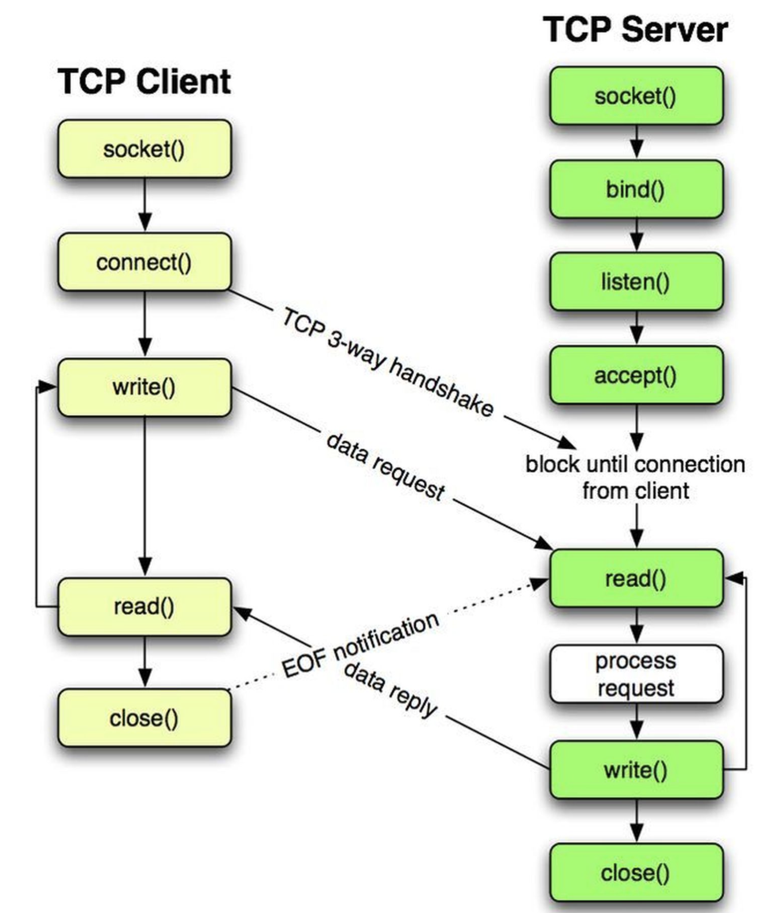
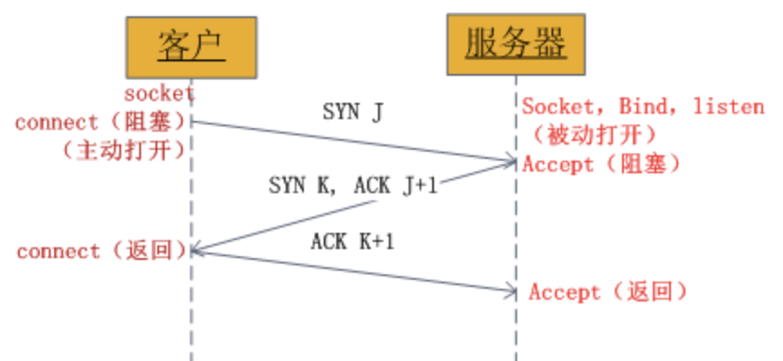
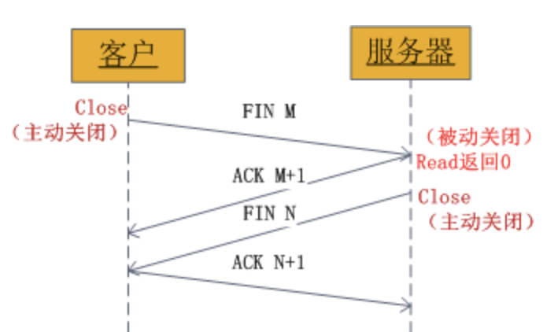
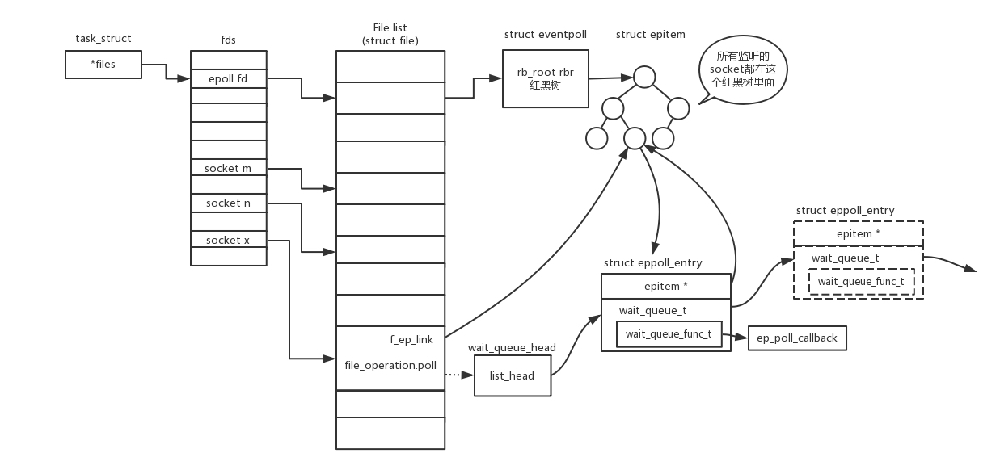

## Socket简介

+ 概念

  Socket(套接字)可以看成是两个网络应用程序进行通信时，各自通信连接中的端点，这是一个逻辑上的概念。它是网络环境中[进程间通信](https://baike.baidu.com/item/进程间通信/1235923)的API(应用程序编程接口)。

+ 表示方法

  套接字Socket=（IP地址：端口号），套接字的表示方法是点分十进制的lP地址后面写上端口号，中间用冒号或逗号隔开。每一个传输层连接唯一地被通信两端的两个端点（即两个套接字）所确定。

+ socket类型

  **1.流套接字(SOCK_STREAM)**

  流套接字用于提供面向连接、可靠的数据传输服务。该服务将保证数据能够实现无差错、无重复送，并按顺序接收。流套接字之所以能够实现可靠的数据服务，原因在于其使用了[传输控制协议](https://baike.baidu.com/item/传输控制协议/9727741)，即TCP(The Transmission Control Protocol)协议。

  **2.数据报套接字(SOCK_DGRAM)**

  数据报套接字提供一种无连接的服务。该服务并不能保证数据传输的可靠性,数据有可能在传输过程中丢失或出现数据重复，且无法保证顺序地接收到数据。数据报套接字使用UDP( User DatagramProtocol)协议进行数据的传输。由于数据报套接字不能保证数据传输的可靠性，对于有可能出现的数据丢失情况，需要在程序中做相应的处理。

  **3.原始套接字(SOCK_RAW)**

  原始套接字可以读写内核没有处理的IP数据包，而流套接字只能读取TCP协议的数据，数据报套接字只能读取UDP协议的数据。因此，如果要访问其他协议发送的数据必须使用原始套接。

+ 工作流程
  套接字之间的连接过程可以分为三个步骤：
  
  1. 服务器监听
  
  2. 客户端请求
  
  3. 连接确认
## Socket通信架构
+ TCP架构
<div align=center>

</div>
客户端过程：
创建Socket，连接服务器，将Socket与远程主机连接，发送数据，读取响应数据，直到数据交换完毕，关闭连接，结束TCP对话。

服务端过程：
服务端先初始化Socket，建立流式套接字，与本机地址及端口进行绑定，然后通知TCP，准备好接收连接，调用accept()阻塞，等待来自客户端的连接。如果这时客户端与服务器建立了连接，客户端发送数据请求，服务器接收请求并处理请求，然后把响应数据发送给客户端，客户端读取数据，直到数据交换完毕。最后关闭连接，交互结束。

TCP三次握手的Socket过程：

<div align=center>

</div>
服务器调用socket()、bind()、listen()完成初始化后，调用accept()阻塞等待；
客户端Socket对象调用connect()向服务器发送了一个SYN并阻塞；
服务器完成了第一次握手，即发送SYN和ACK应答；
客户端收到服务端发送的应答之后，从connect()返回，再发送一个ACK给服务器；
服务器Socket对象接收客户端第三次握手ACK确认，此时服务端从accept()返回，建立连接。

TCP四次挥手的Socket过程：

<div align=center>

</div>
+ UDP架构
<div align=center>

</div>
工作流程：
1. 建立套接字文件描述符，socket()；
2. 设置服务器地址和端口；
3. 向服务器发送数据，sendto()；
4. 接收服务器的数据，recvfrom()；
5. 关闭套接字，close()。

## Socket I/O

一个网络输入的操作流程：网络数据到达网卡  -> 读取内核缓冲区 -> 从内核缓冲区复制数据 -> 用户空间

对于一个套接字上的输入操作，第一步通常涉及等待数据从网络中到达。当所等待数据到达时，它被复制到内核中的某个缓冲区。第二步就是把数据从内核缓冲区复制到应用进程缓冲区。

Unix 有五种 I/O 模型：

- 阻塞式 I/O
- 非阻塞式 I/O
- I/O 复用（select 和 poll）
- 信号驱动式 I/O（SIGIO）
- 异步 I/O（AIO）

#### 阻塞式I/O (Blocking I/O)

应用进程被阻塞，直到数据从内核缓冲区复制到应用进程缓冲区中才返回。

下图中，recvfrom() 用于接收 Socket 传来的数据，并复制到应用进程的缓冲区 buf 中。这里把 recvfrom() 当成系统调用。

应用进程调用recvfrom是当前进程阻塞，然后等待内核数据拷贝复制到应用进程才返回。

<div align=center>

</div>
#### 非阻塞式 I/O (Non-Blocking I/O)

应用进程执行系统调用之后，内核返回一个错误码。应用进程可以继续执行，不需要进入阻塞状态，但是需要不断的执行系统调用来获知 I/O 是否完成，这种方式称为轮询（polling）。
由于 CPU 要处理更多的系统调用，因此这种模型的 CPU 利用率比较低。
非阻塞的接口相比于阻塞型接口的显著差异在于，在被调用之后立即返回。

<div align=center>

</div>

#### I/O复用 (I/O Multiplexing)

select 允许应用程序监视一组文件描述符，等待一个或者多个描述符成为就绪状态，从而完成 I/O 操作。
使用 select 或者 poll 等待数据，并且可以等待多个套接字中的任何一个变为可读。这一过程会被阻塞，当某一个套接字可读时返回，之后再使用 recvfrom 把数据从内核复制到进程中。
它可以让单个进程具有处理多个 I/O 事件的能力。又被称为 Event Driven I/O，即事件驱动 I/O。
如果一个 Web 服务器没有 I/O 复用，那么每一个 Socket 连接都需要创建一个线程去处理。如果同时有几万个连接，那么就需要创建相同数量的线程。相比于多进程和多线程技术，I/O 复用不需要进程线程创建和切换的开销，系统开销更小。

<div align=center>

</div>
#### 信号驱动 I/O (signal driven IO)(不重要)
应用进程使用 sigaction 系统调用（预先告知内核，向内核注册这样一个函数），内核立即返回（也就是应用程序委托内核：“ok了叫我”），应用进程可以继续执行，也就是说等待数据阶段应用进程是非阻塞的。内核在数据到达时向应用进程发送 SIGIO 信号，应用进程收到之后在信号处理程序中调用 recvfrom 将数据从内核复制到应用进程中。
<div align=center>

</div>
#### 异步 I/O (asynchronous IO)

应用进程执行 aio_read 系统调用会立即返回，应用进程可以继续执行，不会被阻塞，内核会在所有操作完成之后向应用进程发送信号。

异步 I/O 与信号驱动 I/O 的区别在于，异步 I/O 的信号是通知应用进程 I/O 完成，而信号驱动 I/O 的信号是通知应用进程可以开始 I/O。
<div align=center>

</div>
#### 五大 I/O 模型比较
+ 同步 I/O：将数据从内核缓冲区复制到应用进程缓冲区的阶段（第二阶段），应用进程会阻塞。

+ 异步 I/O：第二阶段应用进程不会阻塞。

同步 I/O 包括阻塞式 I/O、非阻塞式 I/O、I/O 复用和信号驱动 I/O ，它们的主要区别在第一个阶段。
非阻塞式 I/O 、信号驱动 I/O 和异步 I/O 在第一阶段不会阻塞。

<div align=center>

</div>
#### I/O 复用 (select 、poll、epoll)

**C10K**问题：它的意思是一台机器要维护1万个连接，就要创建1万个进程或者线程，那么操作系统是无法承受的。如果维持1亿用户在线需要10万台服务器，成本也太高了。

select/poll/epoll 都是 I/O 多路复用的具体实现，select 出现的最早，之后是 poll，再是 epoll。

**select**

```
int select(int n, fd_set *readfds, fd_set *writefds, fd_set *exceptfds, struct timeval *timeout);
```

select 允许应用程序监视一组文件描述符，等待一个或者多个描述符成为就绪状态，从而完成 I/O 操作。

- fd_set 使用数组实现，数组大小使用 FD_SETSIZE 定义，所以只能监听少于 FD_SETSIZE 数量的描述符。有三种类型的描述符类型：readset、writeset、exceptset，分别对应读、写、异常条件的描述符集合。
- timeout 为超时参数，调用 select 会一直阻塞直到有描述符的事件到达或者等待的时间超过 timeout。
- 成功调用返回结果大于 0，出错返回结果为 -1，超时返回结果为 0。
```c
fd_set fd_in, fd_out;
struct timeval tv;

// Reset the sets
FD_ZERO( &fd_in );
FD_ZERO( &fd_out );

// Monitor sock1 for input events
FD_SET( sock1, &fd_in );

// Monitor sock2 for output events
FD_SET( sock2, &fd_out );

// Find out which socket has the largest numeric value as select requires it
int largest_sock = sock1 > sock2 ? sock1 : sock2;

// Wait up to 10 seconds
tv.tv_sec = 10;
tv.tv_usec = 0;

// Call the select
int ret = select( largest_sock + 1, &fd_in, &fd_out, NULL, &tv );

// Check if select actually succeed
if ( ret == -1 )
    // report error and abort
else if ( ret == 0 )
    // timeout; no event detected
else
{
    if ( FD_ISSET( sock1, &fd_in ) )
        // input event on sock1

    if ( FD_ISSET( sock2, &fd_out ) )
        // output event on sock2
}
```

**poll**

```
int poll(struct pollfd *fds, unsigned int nfds, int timeout);
```

poll 的功能与 select 类似，也是等待一组描述符中的一个成为就绪状态。

poll 中的描述符是 pollfd 类型的数组，pollfd 的定义如下：

```c
struct pollfd {
               int   fd;         /* file descriptor */
               short events;     /* requested events */
               short revents;    /* returned events */
           };
// The structure for two events
struct pollfd fds[2];

// Monitor sock1 for input
fds[0].fd = sock1;
fds[0].events = POLLIN;

// Monitor sock2 for output
fds[1].fd = sock2;
fds[1].events = POLLOUT;

// Wait 10 seconds
int ret = poll( &fds, 2, 10000 );
// Check if poll actually succeed
if ( ret == -1 )
    // report error and abort
else if ( ret == 0 )
    // timeout; no event detected
else
{
    // If we detect the event, zero it out so we can reuse the structure
    if ( fds[0].revents & POLLIN )
        fds[0].revents = 0;
        // input event on sock1

    if ( fds[1].revents & POLLOUT )
        fds[1].revents = 0;
        // output event on sock2
}
```

**比较**

1. 功能
select 和 poll 的功能基本相同，不过在一些实现细节上有所不同。
  - select 会修改描述符，而 poll 不会；
  - select 的描述符类型使用数组实现，FD_SETSIZE 大小默认为 1024，因此默认只能监听少于 1024 个描述符。如果要监听更多描述符的话，需要修改 FD_SETSIZE 之后重新编译；而 poll 没有描述符数量的限制；
  - poll 提供了更多的事件类型，并且对描述符的重复利用上比 select 高。
  - 如果一个线程对某个描述符调用了 select 或者 poll，另一个线程关闭了该描述符，会导致调用结果不确定。

2. 速度
select 和 poll 速度都比较慢，每次调用都需要将全部描述符从应用进程缓冲区复制到内核缓冲区。
3. 可移植性
几乎所有的系统都支持 select，但是只有比较新的系统支持 poll。

每次Socket所在的文件描述符集合中有Socket发生变化的时候，都需要通过轮询的方式，也就是需要查看所维护的所有的socket，这大大影响了一个服务器程序所能维护的socket连接数量。因而使用select，能够同时维护的socket数量由FD_SETSIZE限制。

**epoll**

将轮询方式改为事件通知的方式，通过注册callback函数的方式，当某个文件描述符发送变化的时候，就会主动通知。
<div align=center>

</div>
```
int epoll_create(int size);
int epoll_ctl(int epfd, int op, int fd, struct epoll_event *event)；
int epoll_wait(int epfd, struct epoll_event * events, int maxevents, int timeout);
```

epoll_ctl() 用于向内核注册新的描述符或者是改变某个文件描述符的状态。已注册的描述符在内核中会被维护在一棵红黑树上，通过回调函数内核会将 I/O 准备好的描述符加入到一个链表中管理，进程调用 epoll_wait() 便可以得到事件完成的描述符。

假设进程打开了Socket m, n, x等多个文件描述符，现在需要通过epoll来监听是否这些Socket都有事件发生。其中epoll_create创建一个epoll对象，也是一个文件，也对应一个文件描述符，同样也对应着打开文件列表中的一项。在这项里面有一个红黑树，在红黑树里，要保存这个epoll要监听的所有Socket。

当epoll_ctl添加一个Socket的时候，其实是加入这个红黑树，同时红黑树里面的节点指向一个结构，将这个结构挂在被监听的Socket的事件列表中。当一个Socket来了一个事件的时候，可以从这个列表中得到epoll对象，并调用call back通知它。

这种通知方式使得监听的Socket数据增加的时候，效率不会大幅度降低，能够同时监听的Socket的数目也非常的多了。上限就为系统定义的、进程打开的最大文件描述符个数。因而，**epoll被称为解决C10K问题的利器**。

```c
// Create the epoll descriptor. Only one is needed per app, and is used to monitor all sockets.
// The function argument is ignored (it was not before, but now it is), so put your favorite number here
int pollingfd = epoll_create( 0xCAFE );

if ( pollingfd < 0 )
 // report error

// Initialize the epoll structure in case more members are added in future
struct epoll_event ev = { 0 };

// Associate the connection class instance with the event. You can associate anything
// you want, epoll does not use this information. We store a connection class pointer, pConnection1
ev.data.ptr = pConnection1;

// Monitor for input, and do not automatically rearm the descriptor after the event
ev.events = EPOLLIN | EPOLLONESHOT;
// Add the descriptor into the monitoring list. We can do it even if another thread is
// waiting in epoll_wait - the descriptor will be properly added
if ( epoll_ctl( epollfd, EPOLL_CTL_ADD, pConnection1->getSocket(), &ev ) != 0 )
    // report error

// Wait for up to 20 events (assuming we have added maybe 200 sockets before that it may happen)
struct epoll_event pevents[ 20 ];

// Wait for 10 seconds, and retrieve less than 20 epoll_event and store them into epoll_event array
int ready = epoll_wait( pollingfd, pevents, 20, 10000 );
// Check if epoll actually succeed
if ( ret == -1 )
    // report error and abort
else if ( ret == 0 )
    // timeout; no event detected
else
{
    // Check if any events detected
    for ( int i = 0; i < ready; i++ )
    {
        if ( pevents[i].events & EPOLLIN )
        {
            // Get back our connection pointer
            Connection * c = (Connection*) pevents[i].data.ptr;
            c->handleReadEvent();
         }
    }
}

```

**epoll工作模式**

epoll 的描述符事件有两种触发模式：LT（level trigger）和 ET（edge trigger）。

1. LT 模式

当 epoll_wait() 检测到描述符事件到达时，将此事件通知进程，进程可以不立即处理该事件，下次调用 epoll_wait() 会再次通知进程。是默认的一种模式，并且同时支持 Blocking 和 No-Blocking。

2. ET 模式

和 LT 模式不同的是，通知之后进程必须立即处理事件，下次再调用 epoll_wait() 时不会再得到事件到达的通知。

很大程度上减少了 epoll 事件被重复触发的次数，因此效率要比 LT 模式高。只支持 No-Blocking，以避免由于一个文件句柄的阻塞读/阻塞写操作把处理多个文件描述符的任务饿死。

#### 应用场景

很容易产生一种错觉认为只要用 epoll 就可以了，select 和 poll 都已经过时了，其实它们都有各自的使用场景。

1. select 应用场景

select 的 timeout 参数精度为微秒，而 poll 和 epoll 为毫秒，因此 select 更加适用于实时性要求比较高的场景，比如核反应堆的控制。

select 可移植性更好，几乎被所有主流平台所支持。

poll 应用场景

poll 没有最大描述符数量的限制，如果平台支持并且对实时性要求不高，应该使用 poll 而不是 select。

3. epoll 应用场景

只需要运行在 Linux 平台上，有大量的描述符需要同时轮询，并且这些连接最好是长连接。

需要同时监控小于 1000 个描述符，就没有必要使用 epoll，因为这个应用场景下并不能体现 epoll 的优势。

需要监控的描述符状态变化多，而且都是非常短暂的，也没有必要使用 epoll。因为 epoll 中的所有描述符都存储在内核中，造成每次需要对描述符的状态改变都需要通过 epoll_ctl() 进行系统调用，频繁系统调用降低效率。并且 epoll 的描述符存储在内核，不容易调试。

## 服务器如何接更多的项目？

会了这几个基本的Socket函数之后，你就可以轻松地写一个网络交互的程序了。就像上面的过程一样，在建立连接后，进行一个while循环。客户端发了收，服务端收了发。

当然这只是万里长征的第一步，因为如果使用这种方法，基本上只能一对一沟通。如果你是一个服务器，同时只能服务一个客户，肯定是不行的。这就相当于老板成立一个公司，只有自己一个人，自己亲自上来服务客户，只能干完了一家再干下一家，这样赚不来多少钱。

那作为老板你就要想了，我最多能接多少项目呢？当然是越多越好。

我们先来算一下理论值，也就是**最大连接数**，系统会用一个四元组来标识一个TCP连接。

```
{本机IP, 本机端口, 对端IP, 对端端口}
```

服务器通常固定在某个本地端口上监听，等待客户端的连接请求。因此，服务端端TCP连接四元组中只有对端IP, 也就是客户端的IP和对端的端口，也即客户端的端口是可变的，因此，最大TCP连接数=客户端IP数×客户端端口数。对IPv4，客户端的IP数最多为2的32次方，客户端的端口数最多为2的16次方，也就是服务端单机最大TCP连接数，约为2的48次方。

当然，服务端最大并发TCP连接数远不能达到理论上限。首先主要是**文件描述符限制**，按照上面的原理，Socket都是文件，所以首先要通过ulimit配置文件描述符的数目；另一个限制是**内存**，按上面的数据结构，每个TCP连接都要占用一定内存，操作系统是有限的。

所以，作为老板，在资源有限的情况下，要想接更多的项目，就需要降低每个项目消耗的资源数目。

### 方式一：将项目外包给其他公司（多进程方式）

这就相当于你是一个代理，在那里监听来的请求。一旦建立了一个连接，就会有一个已连接Socket，这时候你可以创建一个子进程，然后将基于已连接Socket的交互交给这个新的子进程来做。就像来了一个新的项目，但是项目不一定是你自己做，可以再注册一家子公司，招点人，然后把项目转包给这家子公司做，以后对接就交给这家子公司了，你又可以去接新的项目了。

这里有一个问题是，如何创建子公司，并如何将项目移交给子公司呢？

在Linux下，创建子进程使用fork函数。通过名字可以看出，这是在父进程的基础上完全拷贝一个子进程。在Linux内核中，会复制文件描述符的列表，也会复制内存空间，还会复制一条记录当前执行到了哪一行程序的进程。显然，复制的时候在调用fork，复制完毕之后，父进程和子进程都会记录当前刚刚执行完fork。这两个进程刚复制完的时候，几乎一模一样，只是根据fork的返回值来区分到底是父进程，还是子进程。如果返回值是0，则是子进程；如果返回值是其他的整数，就是父进程。

进程复制过程我画在这里。


因为复制了文件描述符列表，而文件描述符都是指向整个内核统一的打开文件列表的，因而父进程刚才因为accept创建的已连接Socket也是一个文件描述符，同样也会被子进程获得。

接下来，子进程就可以通过这个已连接Socket和客户端进行互通了，当通信完毕之后，就可以退出进程，那父进程如何知道子进程干完了项目，要退出呢？还记得fork返回的时候，如果是整数就是父进程吗？这个整数就是子进程的ID，父进程可以通过这个ID查看子进程是否完成项目，是否需要退出。

### 方式二：将项目转包给独立的项目组（多线程方式）

上面这种方式你应该也能发现问题，如果每次接一个项目，都申请一个新公司，然后干完了，就注销掉这个公司，实在是太麻烦了。毕竟一个新公司要有新公司的资产，有新的办公家具，每次都买了再卖，不划算。

于是你应该想到了，我们可以使用**线程**。相比于进程来讲，这样要轻量级的多。如果创建进程相当于成立新公司，购买新办公家具，而创建线程，就相当于在同一个公司成立项目组。一个项目做完了，那这个项目组就可以解散，组成另外的项目组，办公家具可以共用。

在Linux下，通过pthread_create创建一个线程，也是调用do_fork。不同的是，虽然新的线程在task列表会新创建一项，但是很多资源，例如文件描述符列表、进程空间，还是共享的，只不过多了一个引用而已。



新的线程也可以通过已连接Socket处理请求，从而达到并发处理的目的。

上面基于进程或者线程模型的，其实还是有问题的。新到来一个TCP连接，就需要分配一个进程或者线程。一台机器无法创建很多进程或者线程。有个**C10K**，它的意思是一台机器要维护1万个连接，就要创建1万个进程或者线程，那么操作系统是无法承受的。如果维持1亿用户在线需要10万台服务器，成本也太高了。

其实C10K问题就是，你接项目接的太多了，如果每个项目都成立单独的项目组，就要招聘10万人，你肯定养不起，那怎么办呢？

### 方式三：一个项目组支撑多个项目（IO多路复用，一个线程维护多个Socket）

当然，一个项目组可以看多个项目了。这个时候，每个项目组都应该有个项目进度墙，将自己组看的项目列在那里，然后每天通过项目墙看每个项目的进度，一旦某个项目有了进展，就派人去盯一下。

由于Socket是文件描述符，因而某个线程盯的所有的Socket，都放在一个文件描述符集合fd_set中，这就是**项目进度墙**，然后调用select函数来监听文件描述符集合是否有变化。一旦有变化，就会依次查看每个文件描述符。那些发生变化的文件描述符在fd_set对应的位都设为1，表示Socket可读或者可写，从而可以进行读写操作，然后再调用select，接着盯着下一轮的变化。

### 方式四：一个项目组支撑多个项目（IO多路复用，从“派人盯着”到“有事通知”）

上面select函数还是有问题的，因为每次Socket所在的文件描述符集合中有Socket发生变化的时候，都需要通过轮询的方式，也就是需要将全部项目都过一遍的方式来查看进度，这大大影响了一个项目组能够支撑的最大的项目数量。因而使用select，能够同时盯的项目数量由FD_SETSIZE限制。

如果改成事件通知的方式，情况就会好很多，项目组不需要通过轮询挨个盯着这些项目，而是当项目进度发生变化的时候，主动通知项目组，然后项目组再根据项目进展情况做相应的操作。

能完成这件事情的函数叫epoll，它在内核中的实现不是通过轮询的方式，而是通过注册callback函数的方式，当某个文件描述符发送变化的时候，就会主动通知。


如图所示，假设进程打开了Socket m, n, x等多个文件描述符，现在需要通过epoll来监听是否这些Socket都有事件发生。其中epoll_create创建一个epoll对象，也是一个文件，也对应一个文件描述符，同样也对应着打开文件列表中的一项。在这项里面有一个红黑树，在红黑树里，要保存这个epoll要监听的所有Socket。

当epoll_ctl添加一个Socket的时候，其实是加入这个红黑树，同时红黑树里面的节点指向一个结构，将这个结构挂在被监听的Socket的事件列表中。当一个Socket来了一个事件的时候，可以从这个列表中得到epoll对象，并调用call back通知它。

这种通知方式使得监听的Socket数据增加的时候，效率不会大幅度降低，能够同时监听的Socket的数目也非常的多了。上限就为系统定义的、进程打开的最大文件描述符个数。因而，**epoll被称为解决C10K问题的利器**

## 参考链接

https://www.pianshen.com/article/71131084889/

https://github.com/CyC2018/CS-Notes/blob/master/notes/Socket.md

http://www.infotech.vip/cf-net-general.html